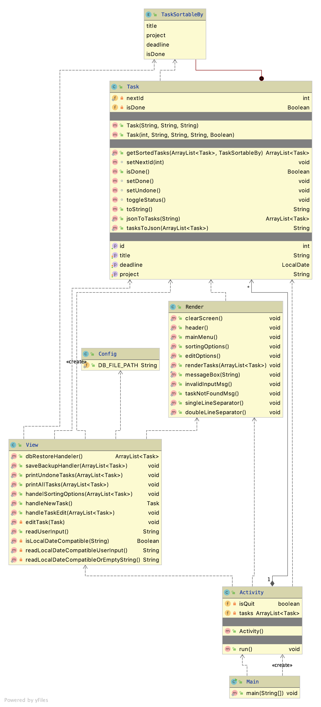

# Simple console Todo app

This is an under-development project! Only use this project for educational purposes! 

#### Features:
- Importing from Json file
- Listing all tasks
- Adding new task
- Editing tasks
- Saving the current instance to a Json file.

#### Get started:
**Requirements:** JDK8+, Maven

1. Clone the project using `git clone {Git Repo URL}`
2. `cd ip`
3. `mvn compile`
4. `mvn exec:java -Dexec.mainClass="com.moein.ip.todo.Main" `

#### Class Diagram:

